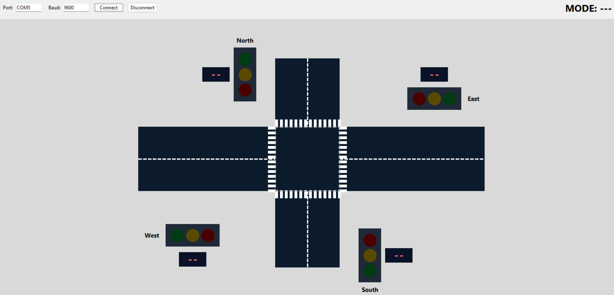

# Traffic Light Controller with PIC16F887

  

A embedded systems project that implements a 2-road traffic light controller on **PIC16F887**, with a **Python Tkinter desktop UI** for monitoring and control over UART. The project focuses on firmware development, peripheral integration, timer-based state control, and PC-side visualization.

## Features

- PIC16F887-based traffic light controller firmware
- 3 operating modes: **AUTO**, **MANUAL**, and **FLASHING**
- UART-based communication between the microcontroller and desktop UI
- Python Tkinter interface for live traffic light visualization
- I2C LCD for mode display on the hardware side
- Button control and serial command control support

## Operating Modes

### AUTO
Runs the normal traffic cycle automatically using timer-based state transitions. The UI displays countdown values for both roads.

### MANUAL
Allows the user to manually select which road gets the green light from the desktop UI.

### FLASHING
Puts the system into a caution mode where the yellow lights blink.

## How It Works

The PIC firmware handles the traffic light state machine, button input, UART command processing, and LCD updates. A timer interrupt is used for timekeeping, while the main loop updates the current mode and periodically sends system state data to the PC.

The desktop UI connects through a serial port, sends commands, and visualizes the current traffic light states in real time.

## Controls

Supported serial/UI commands:

- `A` → AUTO
- `N` → MANUAL
- `F` → FLASHING
- `M` → NEXT MODE
- `R1` → Road 1 Go
- `R2` → Road 2 Go

## How to Use

1. Build and flash the firmware to the PIC16F887.
2. Connect the board to the PC through UART.
3. Run the Python UI.
4. Select the correct COM port and baud rate, then press **Connect**.
5. Use the UI buttons to switch modes and control the intersection.

## Wiring Notes

- `RC3` → I2C SCL
- `RC4` → I2C SDA
- `RB0`, `RB1`, `RB2` → push buttons
- UART baud rate in the current setup: **9600**

## Fault notes
- This is a small project, i do not optimal it for fault tolerance, so there are some faults in the code, such as:
  - All the components must be connected or the hardware may not function correctly.
  - If the LCD is not properly initialized or connected, it will not run correctly until the MCU is reset.